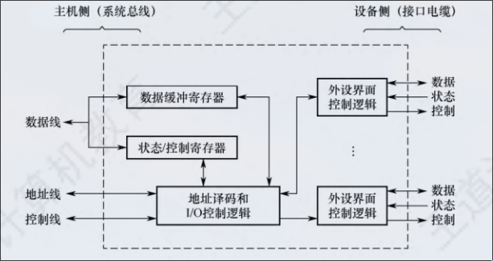

:PROPERTIES:
:ID:       22a05b1a-cae6-4b1d-90bf-e7d62393368d
:END:
#+title: IO接口
#+filetags: :IO-PORT:
#+STARTUP: overview

* IO 接口
** 功能
1. 进行地址译码和设备选择
2. 实现主机和外设的通信联络
3. 实现数据缓冲
4. 信号格式的转换
5. 传送控制命令和状态信息

** 基本结构

- 数据线传送的是读/写数据、状态信息、控制信息和中断类型号
- 地址线传送的是要访问IO接口中的寄存器地址
- 控制线传送的是读/写控制信号，以确认是读寄存器还是写寄存器

** 接口类型
1. 数据传送方式
   - 并行接口（一字节或一个字的所有位同时传送）
   - 串行接口（一位一位有序传送）
2. 主机访问IO设备的控制方式
   - 程序查询接口
   - 中断接口
   - DMA接口
3. 功能选择
   - 可编程接口
   - 不可编程接口

** IO端口及其编址
IO端口是指IO接口电路中可以被CPu直接访问的寄存器，主要有数据端口、状态端口、控制端口

*** 独立编址
对所有IO端口单独进行编址。IO端口的地址空间与主存地址空间是两个独立的地址空间，它们的范围可以重叠，相同地址可能属于不同的地址空间，需要专门的IO指令来表明访问的是IO地址空间，IO指令的地址码给出IO端口号
- 优点：只需要少量的地址线，寻址速度块
- 缺点：IO指令少，灵活性差，CPU需要提供存储器读写、IO设备读写两组控制信号，增大了控制得复杂性

*** 统一编址
是指把主存地址空间分出一部分给IO端口进行编址，IO端口和主存单元在统一地址空间的不同分段中，根据地址范围区分IO端口还是主存单元，用统一的访存指令就可以访问IO端口
- 优点：不需要专门的IO指令，使得CPu访问IO的操作更加灵活
- 端口地址占用了部分主存地址空间，使主存可用容量变小
