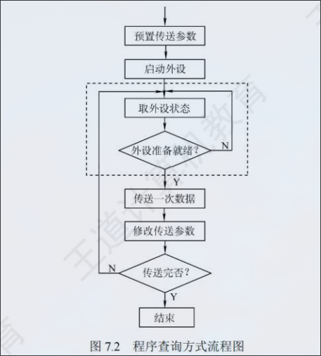

:PROPERTIES:
:ID:       3a13647f-084b-4906-b5b9-4edfef852504
:END:
#+title: IO方式
#+filetags: :IO-METHOD:

* 程序查询方式
信息交换控制由CPU执行程序实现。主机进行IO操作时，先读取设备的状态并根据设备状态决定下一步操作究竟是进行数据传送还是等待

1. CPU初始化程序，并预置传送参数
2. 向IO接口发出命令字
3. 从外设接口读取其状态信息
4. CPU周期或持续的查询设备状态，直到外设准备就绪
5. 传送一次数据
6. 修改地址和计数器参数
7. 判断传送是否结束，若未结束就转到3，直到计数器为0

- 优点：设计简单且设备量小
- 缺点：CPu需要花费大量时间进行查询和等待，一段时间内只能和一台外设交互信息、效率低、CPU存原地踏步现象

* 程序中断方式
** 基本概念
当计算机出现异常情况或者特殊请求，CPU暂时中止当前程序，转去处理异常或者特殊情况
*** 作用
- 实现CPU与IO并行工作
- 处理硬件故障和软件错误
- 实现人机交互，用户干预及其需要用到中断系统
- 实时处理需要借助中断系统来实现快速响应
- 多处理系统中各处理器之间的信息交流和任务切换

** 工作流程
***  中断请求
**** 内外中断
+ 内中断
  是指在处理器和内存内部产生的中断，包括程序运算引起的各种错误，如地址非法、检验错等
+ 外中断
  是指来自处理器和内存以外的部件引起的中断，包括IO设备发出的IO中

**** 硬件中断与软件中断
+ 硬件中断
  通过外部硬件产生的中断，属于外中断
+ 软件中断
  通过某条指令产生的中断，属于内中断

****   非屏蔽中断和可屏蔽中断
+ 非屏蔽中断
  是一种硬件中断，不受中断标志位IF的影响，即使在关中断（IF == 0）的情况下也会响应
+ 可屏蔽中度那
  也是一种硬件中断，受中断标志位的影响，在关中断情况下不接受中断请求

***  中断判优
通过中断判优逻辑确定响应哪个中断请求
+ 硬件实现：硬件排队器
+ 软件实现：通过程序查询
+ 一般逻辑：
  1. 硬件中断属于最高级
  2. 软件中断
  3. 非屏蔽中断
  4. DMA请求优于IO设备传送的中断请求
  5. 高速设备优于低速设备
  6. 输入设备优于输出设备
  7. 实时设备优于普通设备

***  CPU响应中断条件
+ 中断源有中断请求
+ CPU允许中断及开中断
+ 一条指令执行完毕，且没有更紧迫任务

***  中断隐指令
+ CPU响应中断后，经过某些操作，转去执行中断服务程序
+ 完成操作
  + 关中断：保证被中断的程序在中断服务执行完毕后能接着正确执行
  + 保存断点：将原来的PC内容保存
  + 引出中断服务程序：取出中断服务程序的入口地址并传送给PC

***  中断向量
中断服务程序的入口地址

***  中断处理过程
1. 关中断
2. 保存断点
3. 引出中断服务程序
4. 保存现场和屏蔽字
5. 开中断
6. 执行中断服务程序
7. 关中断
8. 恢复现场和屏蔽字
9. 开中断、中断返回

* 多重中断和中断屏蔽技术
** 处理中断时又来了中断
套娃

** 多重中断功能具备的条件
+ 中断服务程序中设置开指令
+ 优先级别高的中断源有权中断优先级别低的中断源

* DMA方式
** 概述
DMA方式在外设与内存之间开辟一条“直接数据通道”

** 特点
1. 使主存与CPU的固定联系脱钩，主存既可被CPU访问，也可以被外设访问
2. 在数据块传送时，主存地址的确定、传送数据的计数等都有硬件电路直接实现
3. 主存中要开辟专用的缓冲区，及时供给和接受外设数据
4. DMA传送速度快，CPU和外设并行工作，提高效率
5. DMA在传送开始前要通过程序进行预处理，结束后要通过中断方式进行后处理

** 组成
1. 主存地址计数器：存放要交换数据的主存地址
2. 传送长度计数器：记录传送数据的长度
3. 数据缓冲寄存器：暂存每次传送的数据
4. DMA请求触发器：IO发出控制信号，使得DMA请求触发置位
5. 控制/状态逻辑：由控制和时序电路

** 传送方式
1. 停止CPU访问主存
   CPU放弃地址线、数据线和有关控制线的使用权，DMA接口获得总线控制权
2. DMA与CPU交替访存
   适用于CPU工作周期比主存存储周期长的情况
3. 周期窃取
   - CPU不在访存，IO的访存请求与CPU未发生冲突
   - CPU正在访存，此时必须待存取周期结束后，CPU再将总线占有权让出
   - IO和CPU同时请求访存，出现访存冲突，此时CPU要暂时放弃总线占有权，有IO设备挪用一个或几个存取周期

** 传送过程
*** 预处理
由CPU完成一些必要准备工作（寄存器置初值、设置传送方向、启动该设备）

*** 数据传送
DMA的数据传输可以以单字节（或字）为基本单位，也可以以数据块为基本单位，数据传送阶段完全由DMA控制

*** 后处理
DMA控制器向CPU发送中断请求，CPU执行中断服务程序做DMA结束处理

* DMA方式与中断方式的区别

** 方式
+ 中断方式是程序切换，需要保护和恢复现场
+ DMA方式除了预处理和后处理，其他时候不占用CPU资源
** 请求的响应
+ 中断请求的响应只能发生在每条指令执行完毕时
+ DMA请求的响应可以发生在每个机器周期结束时

** 传送过程
+ 中断传送过程需要CPU的干预
+ DMA不需要，适于高速外设的数据传送

** 优先级
DMA请求的优先级高于中断请求

** 对异常事件处理
+ 中断方式具有对异常事件的处理能力
+ DMA方式靠硬件传送
