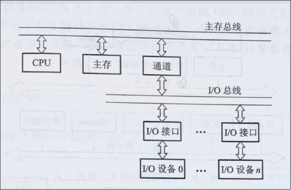
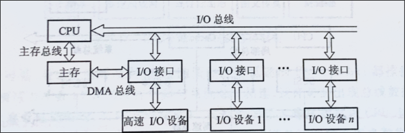
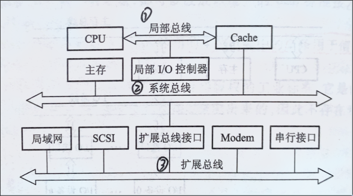
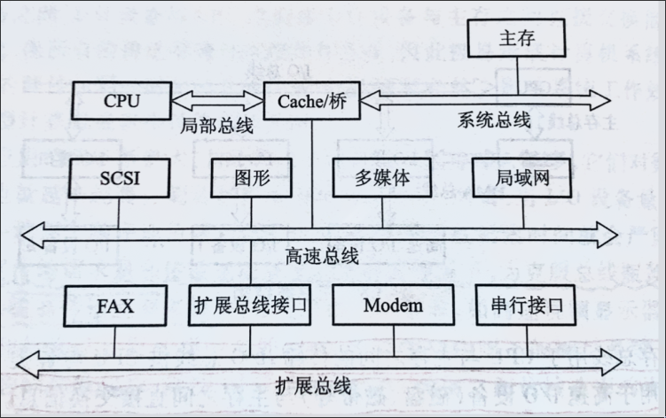

:PROPERTIES:
:ID:       b70e63fa-e006-4e24-9cec-51e6827db3f4
:END:
#+title: 总线概述
#+filetags: :BUS-introduce:
#+STARTUP: overview

* 基本概念
** 定义
+ 总线是一组能为多个部件 _分时、共享_ 的公共信息传送路线
+ 分时： _同一时刻_ 只允许有 _一个_ 部件向总线发送信息
+ 共享：总线上可以挂接多个部件，各个部件之间互相交换的信息可以通过这组线路实时分享

** 总线设备
+ 主设备
  总线的主设备是指获得总线控制权的设备
+ 从设备
  总线的从设备是指主设备访问的设备，它只能响应从主设备发来的各种总线命令

** 总线特性

** 总线的猝发传送方式
给出一个地址，连续传送多个数据

* 总线分类
** 片内兑线
芯片内部的总线，是CPU芯片内部寄存器与寄存器之间，寄存器与ALU之间的公共连接线

** 系统总线
*** 数据总线
- 传输功能部件之间的数据总线
- 双向传输总线
- 位数与机器字长、存储字长有关

*** 地址总线
- 用来指出数据总线上的源数据或目的数据所在的主存单元或IO端口的地址
- 单向传输总线（CPU发出）
- 地址总线的位数与主存地址空间的大小有关

*** 控制总线
- 传输控制信息，包括CPU发出的控制命令和主存（或外设）返回CPU的反馈信号
- 每根线都是单向的，但是总体看是双向的

** 通信总线（外部总线）
+ 时序控制方式分类
  - 同步总线
  - 异步总线
+ 数据传输格式分类
  - 并行总线
    - 优点：总线逻辑简单
    - 缺点：信号线数量过多，由于工作频率高，并行总线的信号线之间会产生严重干扰，每条线对等长要求高
  - 串行总线
    - 优点：抗干扰能力强
    - 缺点：在数据的传送与接受时，需要进行数据的拆卸和装配

* 系统总线结构
** 单总线结构
将CPU、IO设备、主存挂载到同一条总线上

+ 优点：结构简单
+ 缺点：带宽低，负载重

** 双总线结构

+ 主存总线，用于在CPU、主存和通道之间传送数据
+ IO总线，用于在多个外部设备于通道之间传送数据
+ 优点：将低速设备从单总线上分离出来，实现了存储器总线与IO总线分离
+ 缺点：需要增加通道等硬件设备
  - 通道是弱鸡版CPU，具有特殊处理功能，对IO设备进行管理，通道程序存放于主存中

** 三总线结构
*** 第一类

+ DMA总线，主存总线、IO总线
+ 优点：提高了IO设备的性能，提高系统吞吐量
+ 缺点：系统工作效率低
  - DMA总线、主存总线、IO总线同一时刻只有一个能工作

*** 第二类

** 四总线结构

* 总线的性能指标
- 总线的传输周期（总线周期）：一次总线操作所需要的时间（申请阶段、寻址阶段、传输阶段、结束阶段）
- 总线的工作频率：总线周期的倒数
- 总线的时钟周期：机器的时钟周期
- 总线的时钟频率：机器的时钟频率、时钟周期的倒数
- 总线宽度：总线上可以同时传输数据位数（数据总线的根数）
- 总线带宽：单位时间内可以传输的数据位数、总线本身的最大传输率（理想）
- 总线服用：一种信号线在不同的时间传输不同信息，节约空间和成本
- 信号线数：地址总线+数据总线+控制总线
