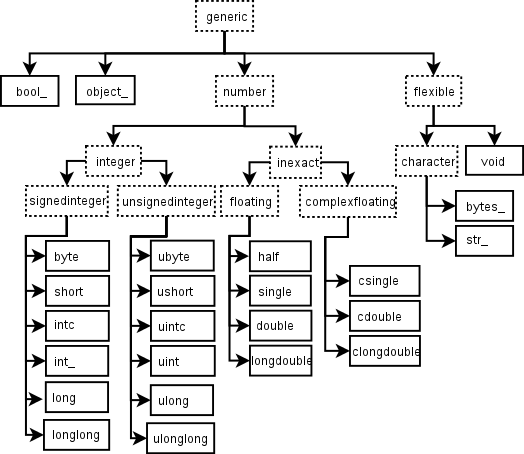

:PROPERTIES:
:ID:       f5015c52-b735-4f08-ae31-3c9c71f948c6
:END:
#+title: numpy-core
#+startup: overview 
#+filetags: :numpy:core:

* 常量
#+begin_src python :results output
import numpy as np
# NOTE: 特殊值
print(np.e)
print(np.pi)
print(np.newaxis)

# NOTE: 空值
print(f"value: {np.nan}, type: {type(np.nan)}, bool: {np.nan is np.nan}")
# NOTE: 可以使用np.isnan来判断
print(np.isnan(1))
print(np.isnan(2.0))
print(np.isnan(np.nan))
print(np.isnan(np.log(-10)))

# NOTE: 无穷
# 正无穷
print(f"value: {np.inf}, type: {type(np.inf)}")
# 负无穷也是无穷
print(np.isinf(-np.inf))
# 判断正无穷
print(np.isposinf(-np.inf))
# 判断负无穷
print(np.isneginf(np.inf))
# 判断有限
print(np.isfinite(np.inf))
#+end_src

#+RESULTS:
#+begin_example
2.718281828459045
3.141592653589793
None
value: nan, type: <class 'float'>, bool: True
False
False
True
True
value: inf, type: <class 'float'>
True
False
False
False
#+end_example

* 数据类型
需要关注内置的数据类型对象 =dtype=
[[https://numpy.org/devdocs/reference/arrays.dtypes.html#arrays-dtypes][内置数据类型对象官方文档]]

数据类型对象描述了如何解释与数组项对应的固定大小的内存块中的字节。
- 数据类型
- 数据大小
- 数据顺序
- 如果是结构化数据类型，则是其他数据类型的集合
- 如果数据类型是子数组，它的形状和数据类型
** 类型

