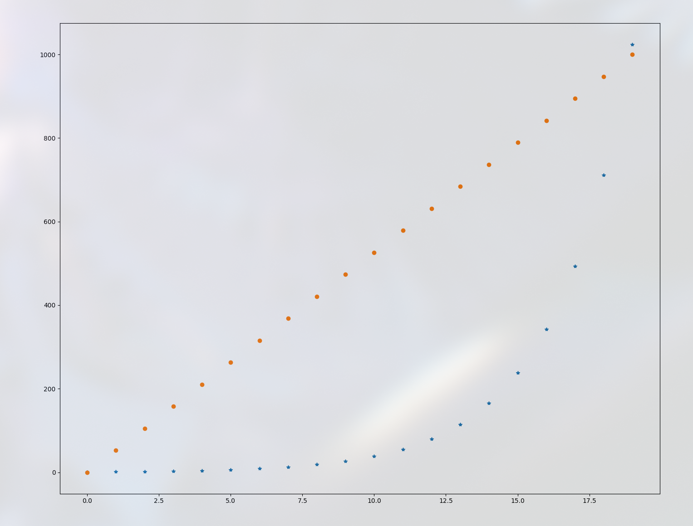

:PROPERTIES:
:ID:       d13139be-1d8e-432e-9f36-68530da3a7cc
:END:
#+title: numpy-创建和生成
#+startup: overview
#+filetags: :python:numpy:创建:

* 从python列表或元组创建
#+begin_src python :results output
import numpy as np

# 一维
a = np.array([1, 2, 3])
print(a)
# 二维小数
b = np.array([[1, 2.0, 3], [4, 5, 6]])
print(b)
# 指定数据类型
c = np.array([1, 2, 3], dtype=np.float16)
print(c)
# NOTE: 如果指定了数据类型，所有输入的值都会转换为对应的类型，且不会四舍五入
lst = [[1, 2, 3], [4, 5, 6.8]]
d = np.array(lst, dtype=np.int32)
print(d)
#+end_src

不建议使用tuple创建

* 使用arange生成
range 是 Python 内置的整数序列生成器，arange 是 numpy 的，效果类似，会生成一维的向量。我们偶尔会需要使用这种方式来构造 array，比如：
+ 需要创建一个连续一维向量作为输入
+ 需要观察筛选、抽样的结果时，有序的array一般更加容易观察
注意：在reshape时，目标的shape需要的元素数量一定要和原始的元素数量相等
#+begin_src python :results output
import numpy as np
# 3x4
a = np.arange(12).reshape(3, 4)
print(a)
# 4x3
b = np.arange(12.0).reshape(4, 3)
print(b)
c = np.arange(100., 124., 2).reshape(3, 2 , 2)
print(c)

# FIXME: shape size 相乘要和生成的元素数量一致
d = np.arange(100., 124., 2).reshape(2, 3 , 4)
print(d)
#+end_src

#+RESULTS:
#+begin_example
[[ 0  1  2  3]
 [ 4  5  6  7]
 [ 8  9 10 11]]
[[ 0.  1.  2.]
 [ 3.  4.  5.]
 [ 6.  7.  8.]
 [ 9. 10. 11.]]
[[[100. 102.]
  [104. 106.]]

 [[108. 110.]
  [112. 114.]]

 [[116. 118.]
  [120. 122.]]]
#+end_example
* 使用linspace/logspace生成
linspace(开头，结尾，数量)
logspace(开头，结尾，数量，base=10)
#+begin_src python :results output
import numpy as np
import matplotlib.pyplot as plt
# 线性
a = np.linspace(0, 9 , 10).reshape(2, 5)
print(a)
b = np.linspace(0, 9, 6).reshape(2, 3)
print(b)

# 指数
c = np.logspace(0, 9 , 6, base=np.e).reshape(2, 3)
print(c)

N = 20
x = np.arange(N)
y1 = np.linspace(0, 10 , N) * 100
y2 = np.logspace(0, 10 , N, base=2)
plt.plot(x, y2, "*")
plt.plot(x, y1, "o")
plt.show()
#+end_src

#+RESULTS:
: [[0. 1. 2. 3. 4.]
:  [5. 6. 7. 8. 9.]]
: [[0.  1.8 3.6]
:  [5.4 7.2 9. ]]
: [[1.00000000e+00 6.04964746e+00 3.65982344e+01]
:  [2.21406416e+02 1.33943076e+03 8.10308393e+03]]

* array条件判断
#+begin_src python :results output
import numpy as np

# NOTE: 判断array是否符合某个条件
arr = np.array([1, 2, 3])
cond1 = arr > 2
print(cond1)

if cond1.any():
    print("只要有一个为True就可以")
if cond1.all():
    print("所有值都为True")
#+end_src
* 使用ones/zeros创建
创建0/1矩阵的快捷方式
需要注意的是：创建出来的 array 默认是 float 类型。
#+begin_src python :results output
import numpy as np

a = np.ones(3)
print(a)
b = np.ones(( 2, 3 ))
print(b)

zero_a = np.zeros((2, 3, 4))
print(zero_a)

# NOTE: 像给定向量那样的0向量(ones_like是1向量)
zero_b = np.zeros_like(b)
print(zero_b)
#+end_src
* 使用random生成
#+begin_src python :results output
import numpy as np

# NOTE: 新的random生成是通过创建一个生成器，再去生成各种数据
rng = np.random.default_rng(12345)
print(rng)

# NOTE: 0-1随机均匀分布
ra = np.random.random(( 2, 3 ))
rng_a = rng.random((2, 3))
print(f"old version: { ra }")
print(50 * '#')
print(f"new version: { rng_a }")
print(50 * '#')

# NOTE: 单个数
num_a = np.random.rand()
num_a2 = rng.random()
print(f"old version: { num_a }")
print(50 * '#')
print(f"new version: {num_a2}")
print(50 * '#')

# NOTE: 指定上下界连续均匀分布
b = np.random.uniform(-1, 1, (2, 3))
b2 = rng.uniform(-1 , 1, (2, 3))
print(f"old version: {b}")
print(50 * '#')
print(f"new version: {b2}")
print(50 * '#')

# NOTE: 随机整数（离散均匀分布）(上下界+形状)
c = rng.integers(0, 10, (2, 3))
print(c)
print(50 * '#')

# NOTE: 标准正态分布
d = rng.standard_normal((2, 4))
print(d)
print(50 * '#')

# NOTE: 高斯分布
e = rng.normal(0 ,1 , (3, 5))
print(e)
print(50 * '#')

print(f"离散均匀分布：{rng.integers(low=0, high=10, size=5)}")
print(f"连续均匀分布: {rng.uniform(low=0, high=10, size=5)}")
print(f"正态（高斯）分布: {rng.normal(loc=0.0, scale = 1.0, size=(2, 3))}")
#+end_src
* 从文件读取
#+begin_src python :results output
import numpy as np
import os

os.makedirs('test', exist_ok=True)

# NOTE: 直接将给定矩阵存储为a.npy
np.save('./test/a', np.array([ [1, 2, 3], [4, 5, 6] ]))

# NOTE: 可以将多个矩阵存在一起
np.savez("./test/b", a=np.arange(12).reshape(3, 4), b=np.arange(12.).reshape(4, 3))

# NOTE: 压缩多个矩阵
np.savez_compressed("./test/c", a=np.arange(12).reshape(3, 4), b=np.arange(12.).reshape(4, 3))

# NOTE: 加载单个矩阵
test_a = np.load("test/a.npy")
print(test_a)

# NOTE: 加载多个矩阵
test_b = np.load("test/b.npz")
print(test_b["a"])
print(test_b["b"])
#+end_src

