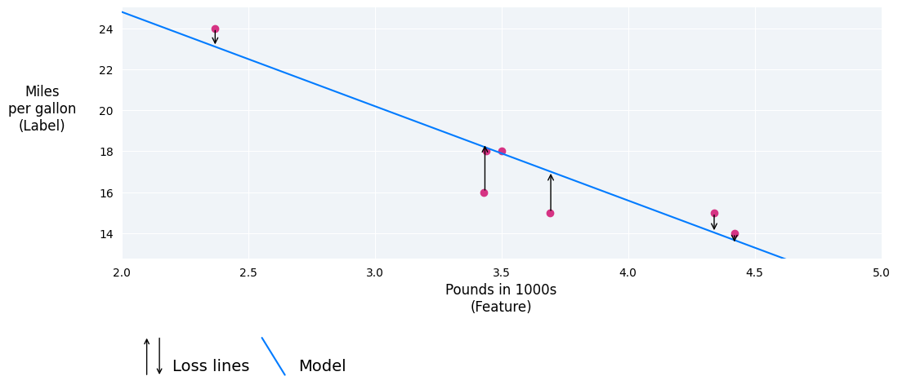
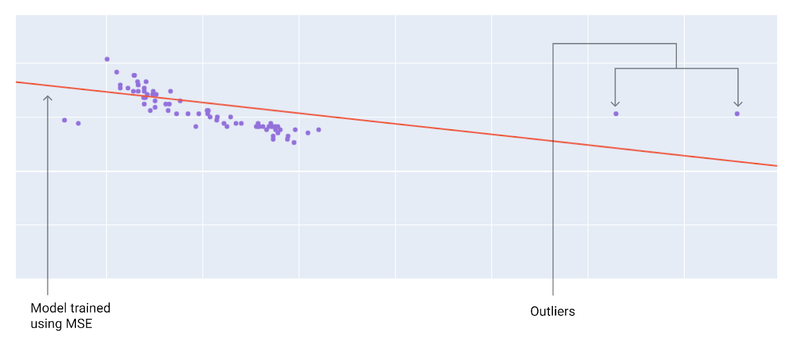

:PROPERTIES:
:ID:       392c9da2-00e5-4528-ad08-9aab2abf0b4b
:END:
#+title: 损失
#+startup: overview
#+filetags: :线性回归:损失:

* 损失函数
损失是一种数值指标，用于描述模型的预测与实际情况的偏差程度。训练模型的目标是尽可能降低损失，使其达到最低值
在下图中，您可以将损失直观地表示为从数据点到模型的箭头。箭头显示了模型的预测与实际值之间的差距。

* 损失距离
在统计学和机器学习中，损失用于衡量预测值与实际值之间的差异。损失侧重于值之间的距离，而不是方向。例如，如果模型预测值为 2，但实际值为 5，我们并不关心损失为负值 (2 - 5 = -3)。相反，我们关心的是值之间的距离为 3。因此，所有用于计算损失的方法都会移除符号。
以下是两种最常见移除符号的方法：
- 计算实际值与预测值之差的绝对值
- 计算实际值与预测值之差的平方
* 损失类型
| 损失类型           | 定义                                  | 公式                                                       |
|---------------------+---------------------------------------+------------------------------------------------------------|
| $$L_{1}$$损失          | 预测值与实际值之间的差的绝对值之和 | $\sum\vert\text{实际值}_{i} - \text{预测值}_{i}\vert$                      |
| 平均绝对误差(MAE)  | 一组N个示例的平均$$L_{1}$$损失         | $\frac{1}{N} \sum\vert\text{实际值}_{i} - \text{预测值}_{i} \vert$         |
| $$L_{2}$$损失          | 预测值与实际值之间的平方差之和     | $\sum (\text{实际值}_{i} - \text{预测值}_{i})^{2}$                    |
| 均方误差（MSE）    | 一组N个示例的平均$$L_{2}$$损失         | $\frac{1}{N} \sum (\text{实际值}_{i} - \text{预测值}_{i})^{2}$        |
| 均方根误差（RMSE） | 均方误差(MSE)的平方根                | $\sqrt{\frac{1}{N} \sum (\text{实际值}_{i} - \text{预测值}_{i})^{2}}$ |

L1 损失与 L2 损失（或 MAE/RMSE 与 MSE）之间的功能差异在于平方。当预测值与标签之间的差值较大时，平方运算会使损失变得更大。当差值较小（小于 1）时，平方运算会使损失更小。

在某些使用情形下，与 L2 损失或 MSE 相比，MAE 和 RMSE 等损失指标可能更可取，因为它们往往更易于人工解读，并且它们使用与模型预测值相同的比例来衡量误差。

- 注意：MAE 和 RMSE 的差异可能非常大。MAE 表示平均预测误差，而 RMSE 表示误差的“离散程度”，并且受较大误差的影响更大。

在同时处理多个示例时，我们建议对所有示例的损失求平均值，无论使用 MAE、MSE 还是 RMSE。

* 选择损失
是否使用 MAE 或 MSE 可能取决于数据集以及您希望如何处理某些预测。数据集中的大多数特征值通常都位于一个明确的范围内。例如，汽车的重量通常介于 2,000 到 5,000 磅之间，每加仑汽油可行驶的里程介于 8 到 50 英里之间。一辆重 8,000 磅的汽车，或者一辆每加仑汽油能行驶 100 英里的汽车，都超出了典型范围，会被视为离群点。
离群值还可以指模型的预测值与实际值之间的差距。例如，3,000 磅在典型汽车重量范围内，而每加仑 40 英里在典型燃油效率范围内。不过，如果一辆 3,000 磅的汽车每加仑汽油能行驶 40 英里，那么就模型的预测而言，这辆汽车将是一个离群点，因为模型会预测一辆 3,000 磅的汽车每加仑汽油能行驶大约 20 英里。

选择最佳损失函数时，请考虑您希望模型如何处理离群值。例如，MSE 会使模型更接近离群点，而 MAE 则不会。与 L1 损失相比，L2 损失对离群值的罚分要高得多。例如，以下图片展示了使用 MAE 训练的模型和使用 MSE 训练的模型。红线表示将用于进行预测的完全训练好的模型。与使用 MAE 训练的模型相比，离群点更接近使用 MSE 训练的模型。

图 9. MSE 损失会使模型更接近离群值。

[[file:pic/model-mae.png]]
图 10. MAE 损失可使模型远离离群值。

注意模型与数据之间的关系：
- MSE： 模型更接近离群点，但距离大多数其他数据点更远
- MAE： 模型离离群点距离更远，但离大多数其他数据点的距离更近
