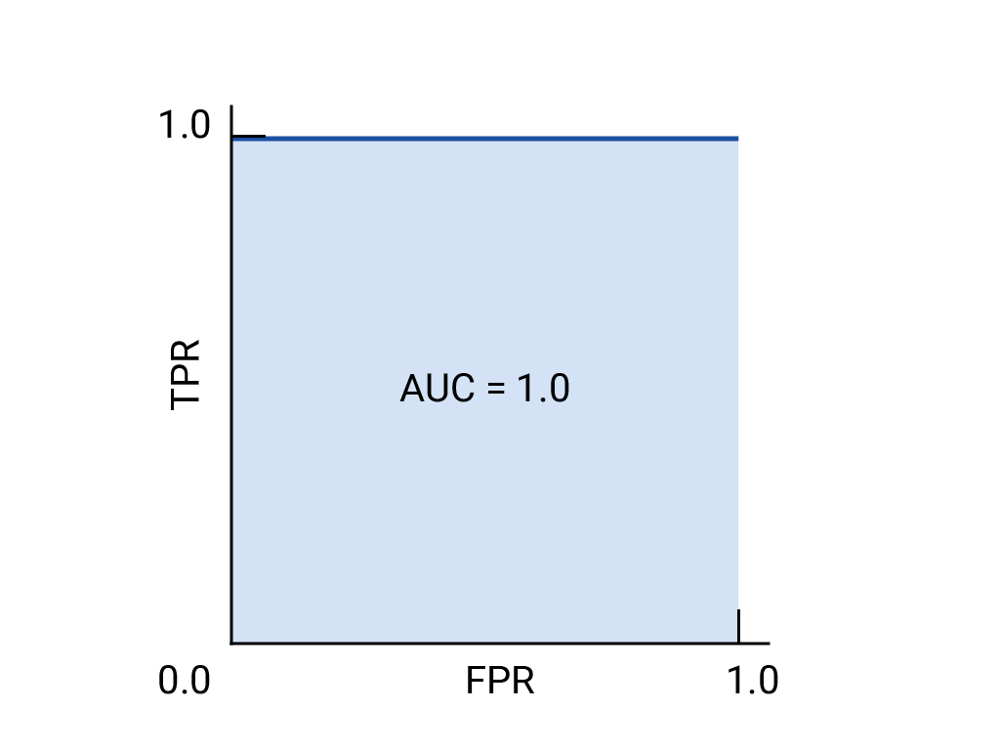
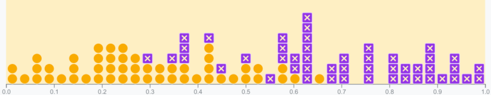
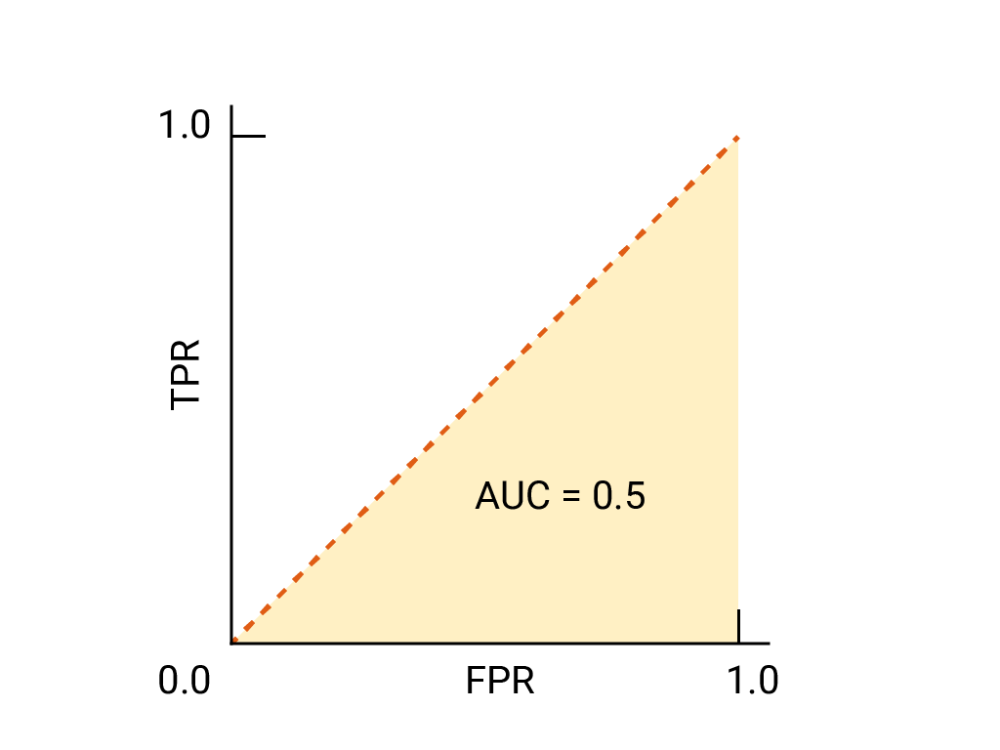
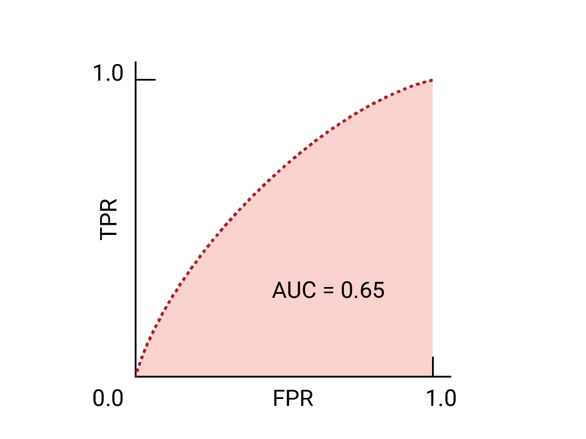
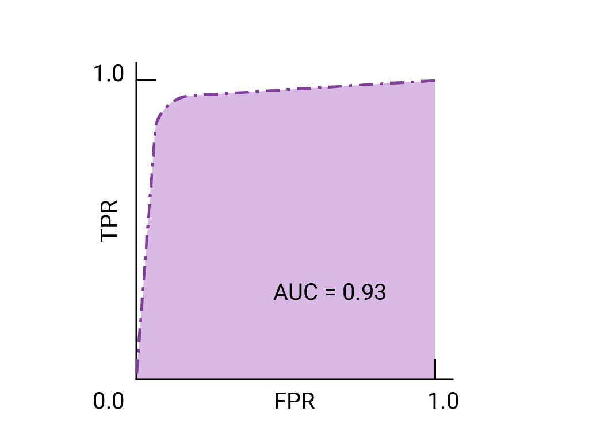
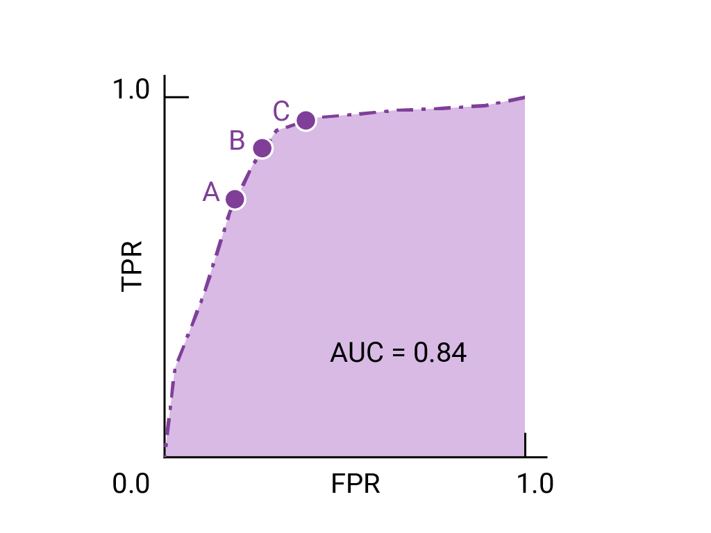

:PROPERTIES:
:ID:       e02fc899-f694-4ec3-99f2-36710dca39cc
:END:
#+title: 接收器操作特征曲线(ROC)
#+startup: overview
#+filetags: :分类:ROC:

当我们想要评估模型在所有可能阈值下的质量，则需要使用不同的工具

* [[https://developers.google.com/machine-learning/glossary?hl=zh-cn#roc-receiver-operating-characteristic-curve][ROC详解]]
* 绘制ROC曲线
绘制 ROC 曲线的方法是：计算每个可能的阈值（在实践中，是按选定的间隔）的真正例率 (TPR) 和假正例率 (FPR)，然后将 TPR 与 FPR 绘制到图表中。完美的模型在某个阈值下的 TPR 为 1.0，FPR 为 0.0，如果忽略所有其他阈值，则可以用 (0, 1) 点表示，也可以用以下方式表示：
#+ATTR_ORG: :width 500
    

* 曲线下面积(AUC)
AUC表示：如果给定随机选择的正例和负例，模型将正例排在负例之上的概率
如上图的完美模型包含边长为1的正方形，其曲线下面积(AUC)为1.0。这意味着，模型将随机选择的正例正确排在随机选择的负例之上的概率为 100%。换句话说，查看下方的数据点分布情况，AUC 可提供模型将随机选择的方形放置在随机选择的圆形右侧的概率，而不会受到阈值设置位置的影响。

更具体地说，AUC 为 1.0 的垃圾邮件分类器始终会为随机垃圾邮件分配比随机合规电子邮件更高的垃圾邮件权重。每封电子邮件的实际分类取决于您选择的阈值。

对于二元分类器，如果模型的效果与随机猜测或抛硬币的效果完全一样，则其ROC曲线是一个从（0，0）到（1，1）的对角线。AUC为0.5，表示正确对随机正例和负例进行排名的概率为50%       

在垃圾邮件的例子中，AUC为0.5的垃圾邮件分类器仅在50%的情况下会将垃圾邮件的权重设置为高于合法邮件的权重
#+ATTR_ORG: :width 500

* 用于选择模型和阈值的AUC和ROC
AUC是比较两个不同模型性能的有效衡量指标，前提是数据集大致平衡。曲线下面积较大的模型通常是更好的模型
#+ATTR_ORG: :width 500

如图，下方图的AUC较高，表示该模型由于上方曲线对应的模型

ROC 曲线上最接近 (0,1) 的点表示给定模型效果最佳的阈值范围。如阈值、混淆矩阵和指标选择和权衡部分所述，您选择的阈值取决于哪个指标对特定用例而言最重要。请考虑下图中的点 A、B 和 C，每个点都代表一个阈值：
#+ATTR_ORG: :width 600

如果假正例（误报）的代价很高，则可能有必要选择 FPR 较低的阈值（例如 A 点），即使 TPR 会降低也是如此。反之，如果假正例成本较低，而假负例（漏掉的真正例）成本较高，则点 C 的阈值（可最大限度地提高 TPR）可能更为合适。如果费用大致相当，点 B 在 TPR 和 FPR 之间可能提供最佳平衡。
