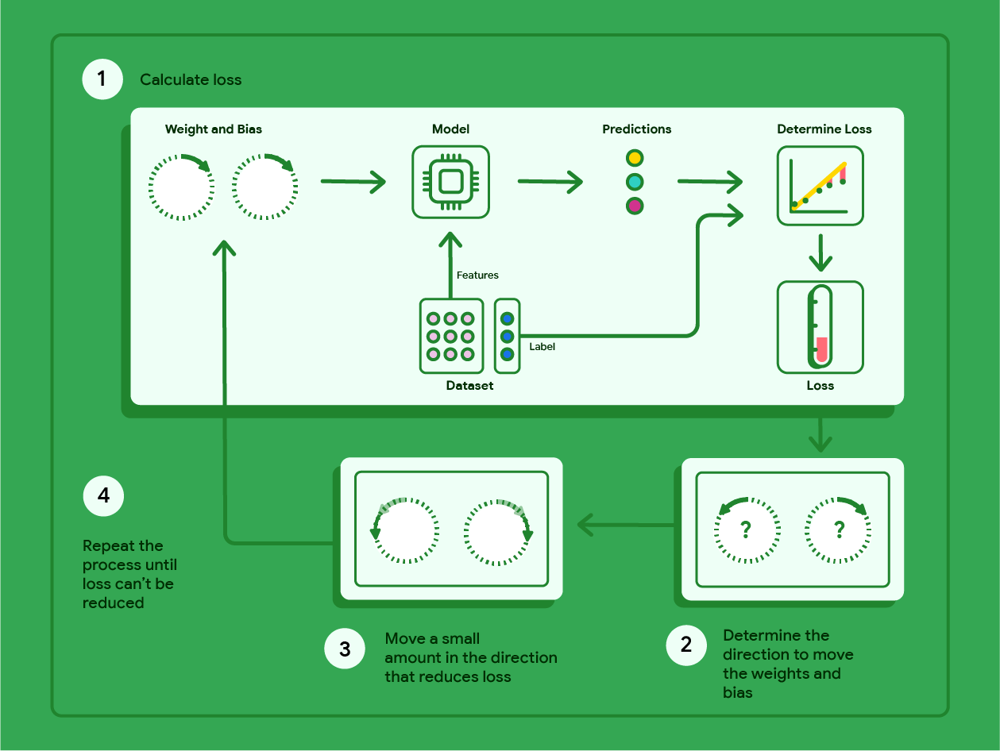
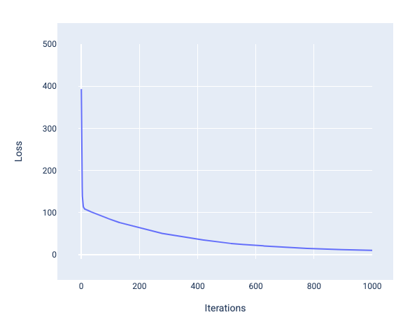
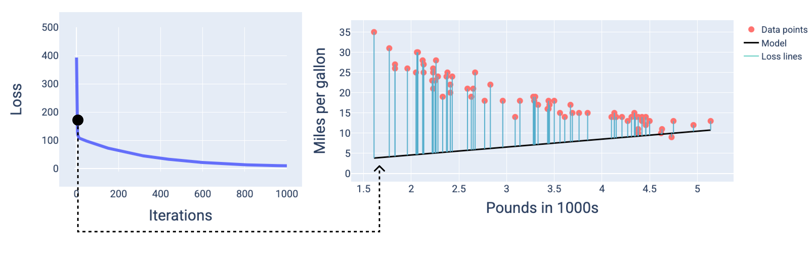
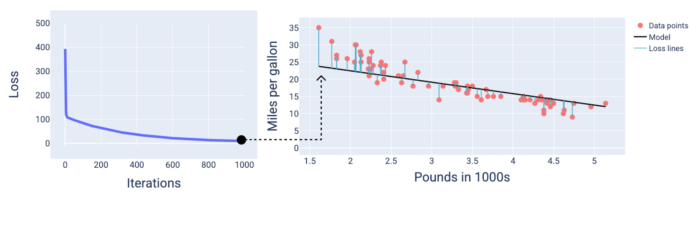
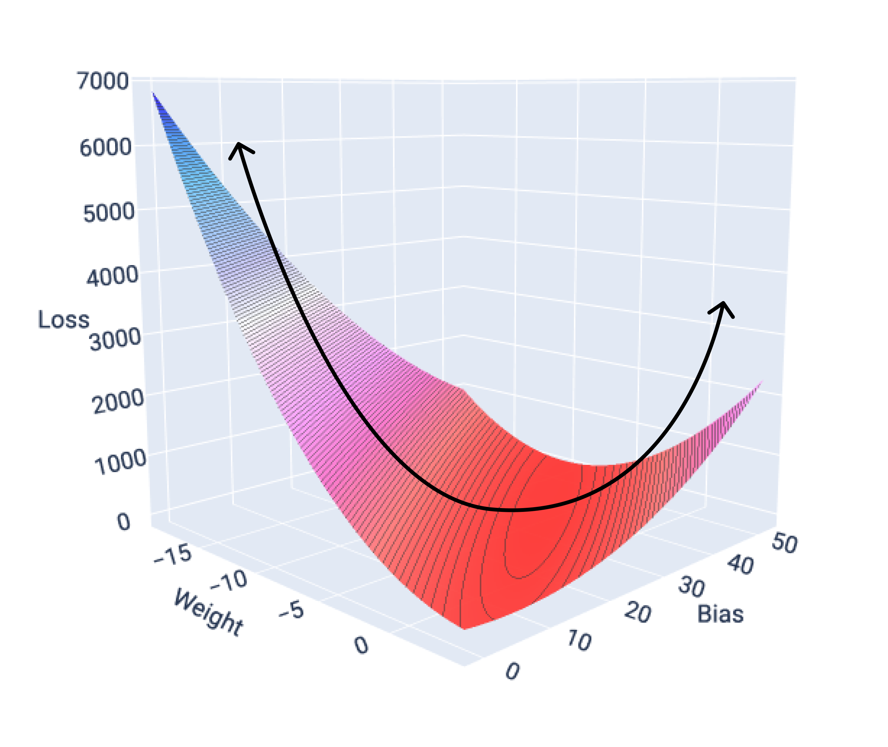
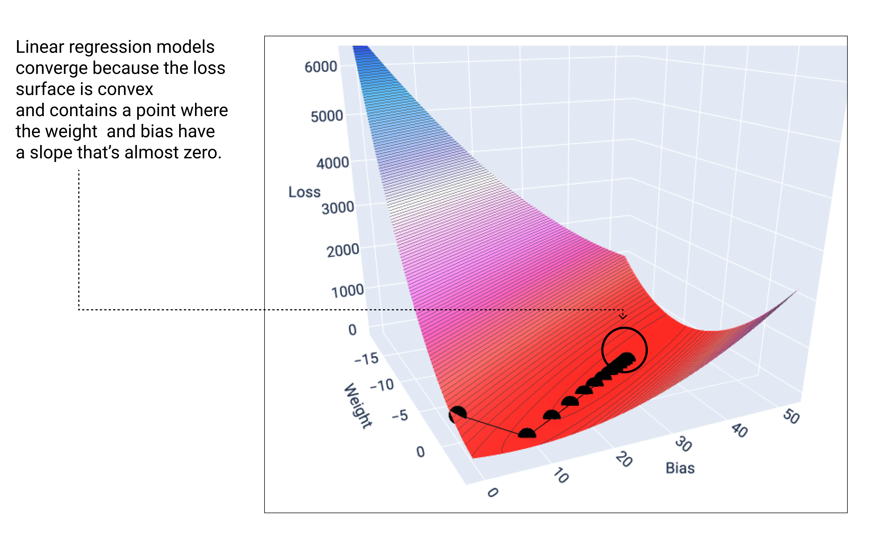

:PROPERTIES:
:ID:       eda037c2-6396-44e4-9401-a6ca6436e5c3
:END:
#+title: 梯度下降法
#+startup: overview
#+filetags: :线性回归:梯度下降法:

* 梯度下降
梯度下降法是一种数学技巧，可迭代地找到能使模型产生最低损失的权重和偏差。梯度下降法通过重复以下过程（迭代次数由用户定义）来找到最佳权重和偏差。

#+ATTR_ORG: :width 800

模型开始训练时，权重和偏差会随机化接近于0的值，然后重复执行以下步骤：
1. 使用当前权重和偏差计算损失
2. 确定可减少损失的权重和偏差移动方向
3. 将权重和偏差值沿可减少损失方向移动少量距离
4. 返回到第1步，重复次过程，直到模型无法进一步减少损失为止

* 模型收敛和损失曲线
在训练模型时，您通常会查看损失曲线，以确定模型是否已收敛。损失曲线显示了损失随模型训练的变化情况。下图显示了典型的损失曲线。y 轴表示损失，x 轴表示迭代次数：
#+ATTR_ORG: :width 800

在前几次迭代中，损失大幅减少，然后逐渐减少，在第 1,000 次迭代左右趋于平缓。经过 1,000 次迭代后，我们基本上可以确定模型已收敛。

在下图中，我们绘制了模型在训练过程中的三个时间点（开始、中间和结束）的状态。直观呈现训练过程中快照的模型状态，可巩固权重和偏差更新、损失减少与模型收敛之间的联系。

在图中，我们使用特定迭代次数时得出的权重和偏差来表示模型。在包含数据点和模型快照的图中，从模型到数据点的蓝色损失线表示损失量。线条越长，损失越大。

在下图中，我们可以看到，在第二次迭代左右，由于损失过大，模型将无法很好地进行预测。

在大约第 1,000 次迭代时，我们可以看到模型已经收敛，生成了损失尽可能最低的模型。

* 收敛和凸函数
线性模型的损失函数始终会生成凸面。根据这一属性，当线性回归模型收敛时，我们知道该模型已找到可产生最低损失的权重和偏差。

如果我们绘制具有一个特征的模型的损失曲面图，可以看到其凸形。下图显示了假设的每加仑英里数数据集的损失曲面。权重位于 x 轴上，偏差位于 y 轴上，损失位于 z 轴上：
#+ATTR_ORG: :width 600

当线性模型找到最小损失时，它会收敛。如果我们绘制梯度下降法期间的权重和偏差点图，这些点看起来就像一个球从山上滚下来，最终停在没有更多向下坡度的点。
- 注意： 模型几乎找不到可以最大限度减少损失的确切权重和偏差值，但可以找到非常接近的值
#+ATTR_ORG: :width 600

请注意，黑色损失点会形成损失曲线的确切形状：先是急剧下降，然后逐渐向下倾斜，直到达到损失曲面上的最低点。
- 注意：此点表示模型的最小损失，通常大于 0。损失为 0 意味着模型与每个数据点的拟合度都非常高，这通常是过拟合的迹象（即模型过于复杂/强大）。
