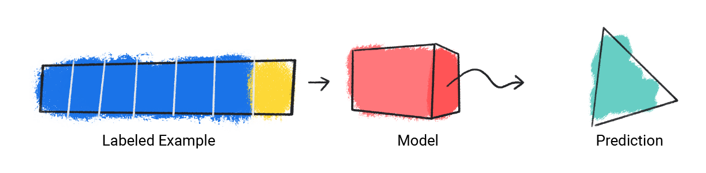
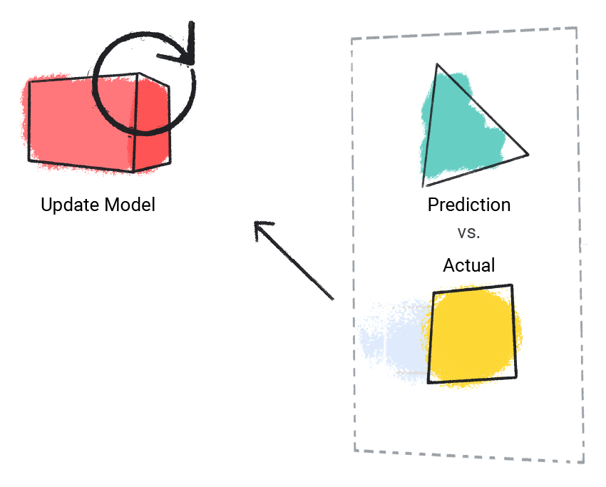
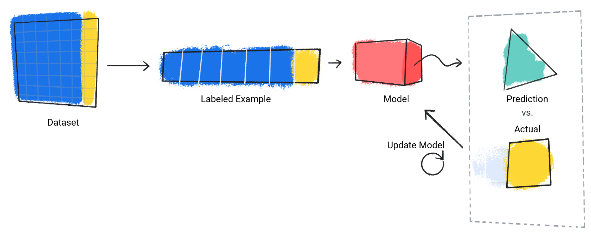
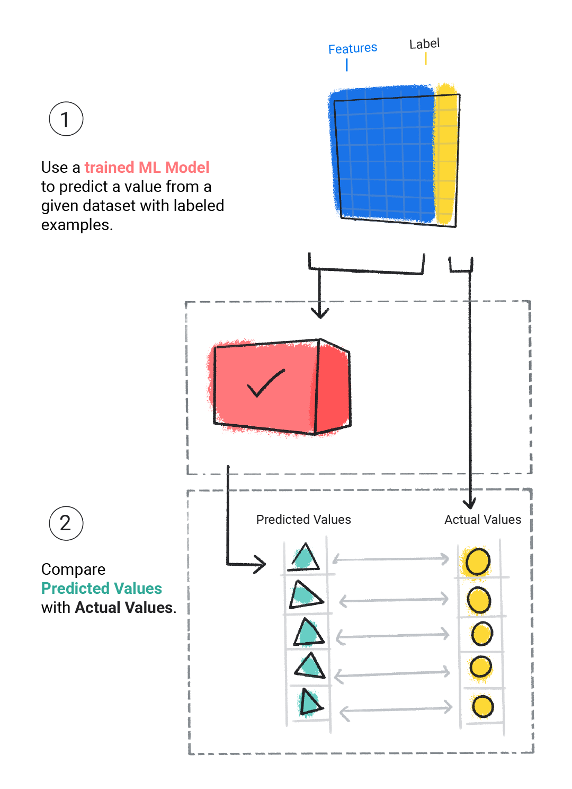

:PROPERTIES:
:ID:       d98f87ee-5582-423e-a786-db4c5e98eeb9
:END:
#+title: 监督式学习
#+startup: overview
#+filetags: :MachineLearning:监督:

监督学习模型在看到大量包含正确答案的数据后，可以发现数据中产生正确答案的元素之间的关联，从而做出预测。这就像学生通过学习包含问题和答案的旧考试来学习新知识。当学生通过足够多的旧考试进行训练后，便能充分做好准备来参加新考试。这些机器学习系统是“监督式”的，因为人类会向机器学习系统提供已知正确结果的数据。

监督式学习最常见的两个场景，回归和分类
* 回归
回归模型可预测数值。例如，预测降雨量（以英寸或毫米为单位）的天气模型就是一种回归模型。
* 分类
分类模型可预测某事物属于某个类别的可能性。与输出为数值的回归模型不同，分类模型输出的值用于指明某事物是否属于特定类别。例如，分类模型用于预测电子邮件是否为垃圾邮件，或照片中是否包含猫。

分类模型分为两组：二元分类和多类别分类。二元分类模型会输出仅包含两个值的类中的一个值，例如，输出 rain 或 no rain 的模型。多类别分类模型会输出一个值，该值来自包含两个以上值的类别，例如，可以输出 rain、hail、snow 或 sleet 的模型。

* 基础概念
** 数据
数据是机器学习的推动力。数据以存储在表格中的字词和数字的形式提供，或以图片和音频文件中捕获的像素和波形的值的形式提供。我们会在数据集中存储相关数据。例如，我们可能有以下数据集：
- 猫的图片
- 房价
- 天气信息
数据集由特征和标签的各个示例组成，您可以将示例视为类似于电子表格中的单行。特征是监督式模型用于预测标签的值。标签是“答案”，即我们希望模型预测的值。在用于预测降雨量的天气模型中，特征可以是纬度、经度、温度、湿度、云量、风向和气压。标签为降雨量。
*** 数据集特征
数据集的特点在于其规模和多样性。大小表示示例数量。多样性表示这些示例涵盖的范围。优质的数据集既大又多样。

数据集可以是庞大且多样化的数据集，也可以是庞大但不多样化的数据集，还可以是小但高度多样化的数据集。换句话说，大型数据集并不能保证足够的多样性，而高度多样化的数据集也不能保证足够的示例。例如，一个数据集可能包含 100 年的数据，但仅限 7 月份。如果使用此数据集来预测 1 月份的降雨量，预测结果会不准确。反之，数据集可能仅涵盖几年，但包含每个月的数据。由于此数据集包含的年份不足以反映变异性，因此可能会产生不准确的预测结果。

数据集还可以通过其特征数量进行描述。例如，某些天气数据集可能包含数百个地图项，从卫星图像到云层覆盖率值都有。其他数据集可能只包含三四个特征，例如湿度、大气压和温度。包含更多特征的数据集可以帮助模型发现更多模式并做出更准确的预测。不过，包含更多特征的数据集并不一定会生成能做出更准确预测的模型，因为某些特征可能与标签没有因果关系。
** 型号
在监督式学习中，模型是一组复杂的数字，用于定义特定输入特征模式与特定输出标签值之间的数学关系。模型会通过训练发现这些模式。
** 培训
监督式模型必须先接受训练，然后才能进行预测。为了训练模型，我们会向模型提供包含标记示例的数据集。模型的目标是找出根据特征预测标签的最佳解决方案。该模型会将其预测值与标签的实际值进行比较，以找到最佳解决方案。模型会根据预测值与实际值之间的差异（定义为“损失”）逐步更新其解决方案。换句话说，模型会学习特征与标签之间的数学关系，以便对未见过的数据做出最准确的预测。

例如如果模型预测降雨量为 1.15 inches，但实际值为 .75 inches，则模型会修改其解决方案，使其预测结果更接近 .75 inches。在模型查看数据集中的每个示例（在某些情况下，会多次查看）后，它会得出一个解决方案，该解决方案能针对每个示例做出平均最佳预测。

训练模型过程：
1. 该模型接受单个标记示例，并提供预测结果
   
  #+ATTR_ORG: :width 500
   

2. 模型会将器预测值与实际值进行比较，并更新其解决方案
   
  #+ATTR_ORG: :width 500
   

3. 模型会对数据集中的每个标记示例重复此过程。
   

在训练期间，机器学习从业者可以对模型用于进行预测的配置和特征进行微妙调整。例如，某些特征的预测能力比其他特征更强。因此，机器学习从业者可以选择模型在训练期间使用哪些特征。例如，假设某个天气数据集包含 time_of_day 作为地图项。在这种情况下，机器学习从业者可以在训练期间添加或移除 time_of_day，以了解模型在添加或移除 time_of_day 后能否做出更准确的预测。
** 正在评估
我们会评估训练好的模型，以确定其学习效果。评估模型时，我们使用标记数据集，但只向模型提供数据集的特征。然后，我们将模型的预测结果与标签的真实值进行比较。
#+ATTR_ORG: :width 450
 
** 推理
对模型评估结果感到满意后，我们就可以使用该模型对无标签示例进行预测（称为推理）。在天气应用示例中，我们会向模型提供当前天气状况（例如温度、大气压和相对湿度），然后模型会预测降雨量。
