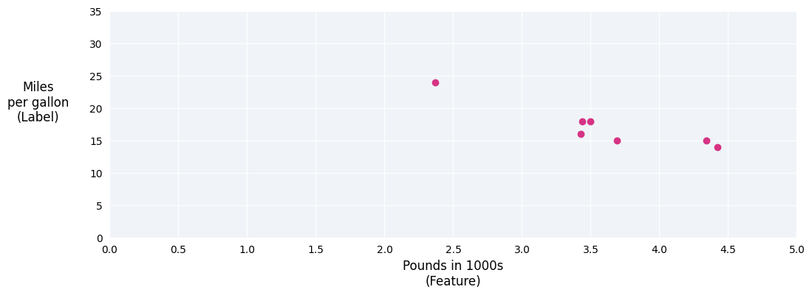
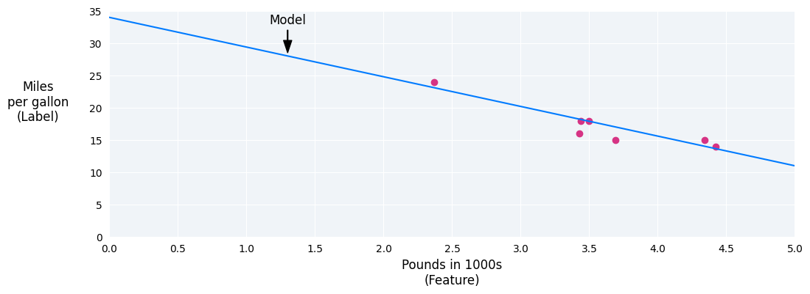
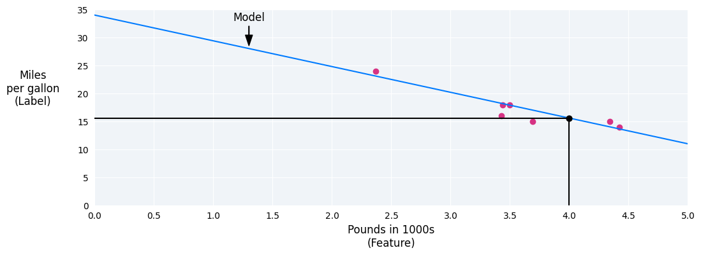
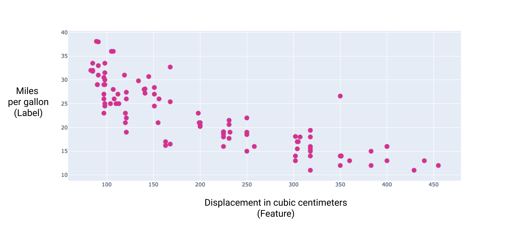
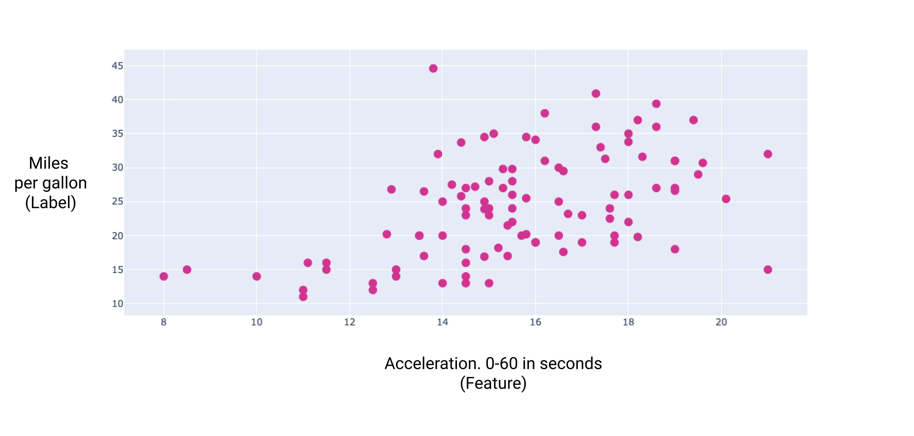

:PROPERTIES:
:ID:       273e1260-2752-4c7f-864e-81d7e308aa00
:END:
#+title: 线性回归
#+startup: overview latexpreview
#+filetags: :MachineLearning:Model:线性回归:

* 基本概念
线性回归是一种用于查找变量之间关系的统计技术。在机器学习背景下，线性回归用于查找特征与标签之间的关系。
例如，假设我们想根据汽车的重量预测汽车的燃油效率（以每加仑英里数表示），并且我们有以下数据集：
| 以千为单位的磅数（特征 | 每加仑英里数（标签） |
|--------------------------+------------------------|
|                      3.5 |                     18 |
|                     3.69 |                     15 |
|                     3.44 |                     18 |
|                     3.43 |                     16 |
|                     4.34 |                     15 |
|                     4.42 |                     14 |
|                     2.37 |                     24 |

如果我们绘制这些点，会得到以下图表：
#+ATTR_ORG: :width 800
    
图 1. 汽车重量（以磅为单位）与每加仑汽油能行驶的英里数评级。汽车越重，每加仑燃油行驶里程数通常越低。

我们可以通过在这些点之间绘制最佳拟合线来创建自己的模型：
#+ATTR_ORG: :width 800

图 2. 通过上图数据绘制的最佳拟合线。

* 线性回归方程
- m是直线的斜率
- x是磅，即我们输入的值
- b是y轴截距
在机器学习中，线性回归模型的方程式如下
$y^{'} = b + w_{1}x_{1}$
其中：
- $y^{'}$ 是预测标签（output）
- b是模型的偏差（y轴截距，之所以存在偏差是因为并非所有模型都从原点（0，0）开始）,在机器学习中，偏差有时称为 $w_{0}$ 。偏差是模型的形参，在训练期间计算得出
- $w_{1}$ 是特征的权重。权重与线性代数方程式中的斜率m概念相同。权重是模型的形参，在训练期间计算得出
- $x_{1}$ 是一个特征，即输入

在上述示例中，我们将根据绘制的直线计算权重和偏差。偏差为34（直线与y轴的交点），权重为-4.6（直线的斜率）。该模型可定义为 $y^{'} = 34 + (-4.6)(x_{1})$ ,我们可以使用这个模型进行预测。例如一辆400磅的汽车预测燃油效率为每加仑15.6英里

* 具有多种特征的模型
虽然上述示例仅使用一种特征（汽车的重量），但更复杂的模型可能依赖于多项特征，每项特征都有一个单独的权重（ $w_{1}$ $w_{2}$ $w_{3}$ ）, 例如依赖于5个特征的模型可以写成如下形式：
$y^{'} = b +  w_1 x_1 + w_2 x_2 + w_3 x_3 + w_4 x_4$

例如，预测燃油效率的模型还可以使用以下特征：
- 发动机排量
- 加速
- 圆柱数
- 马力
通过绘制这几个额外特征的图表，我们可以看到它们与标签（每加仑行驶里程数）也存在线性关系：
#+ATTR_ORG: :width 800

图 6. 汽车的排量（以立方厘米为单位）及其每加仑燃油行驶里程数评级。一般来说，汽车的发动机越大，每加仑燃油行驶里程就越低。

#+ATTR_ORG: :width 800

图 7. 汽车的加速度及其每加仑英里数评级。汽车的加速时间越长，每加仑燃油行驶里程评级通常越高。
* [[id:392c9da2-00e5-4528-ad08-9aab2abf0b4b][损失]]
* [[id:eda037c2-6396-44e4-9401-a6ca6436e5c3][梯度下降法]]
* [[id:1f304614-b5de-4749-9972-a488c9173cfb][超参数]]
