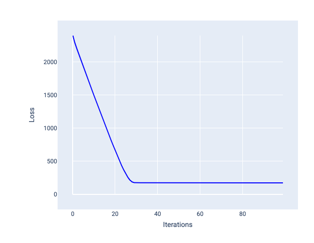
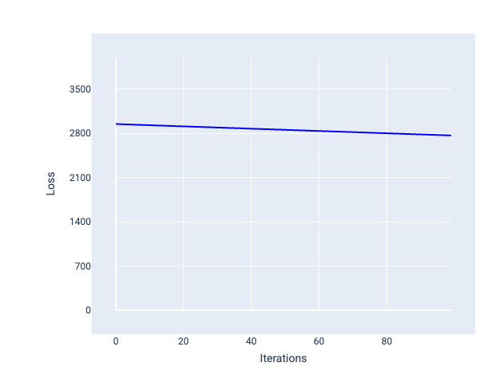
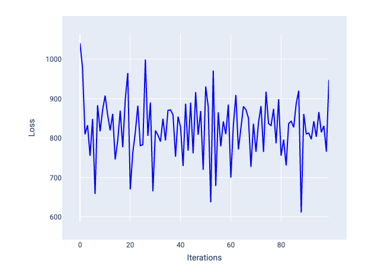
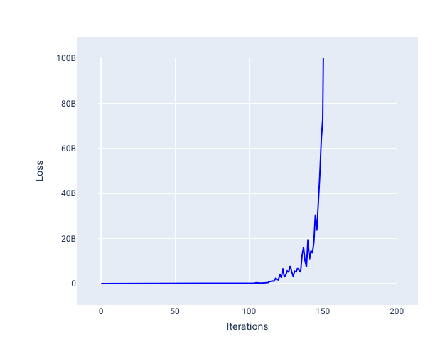
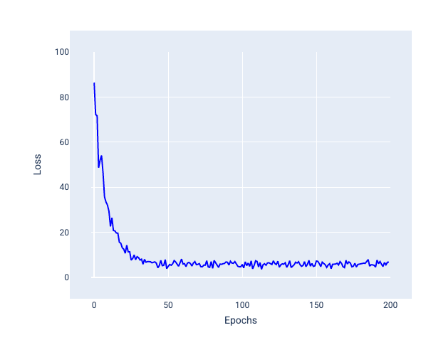
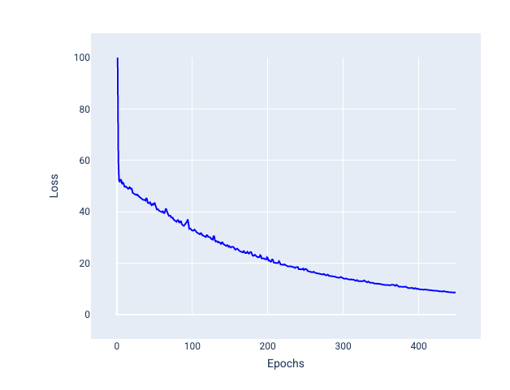
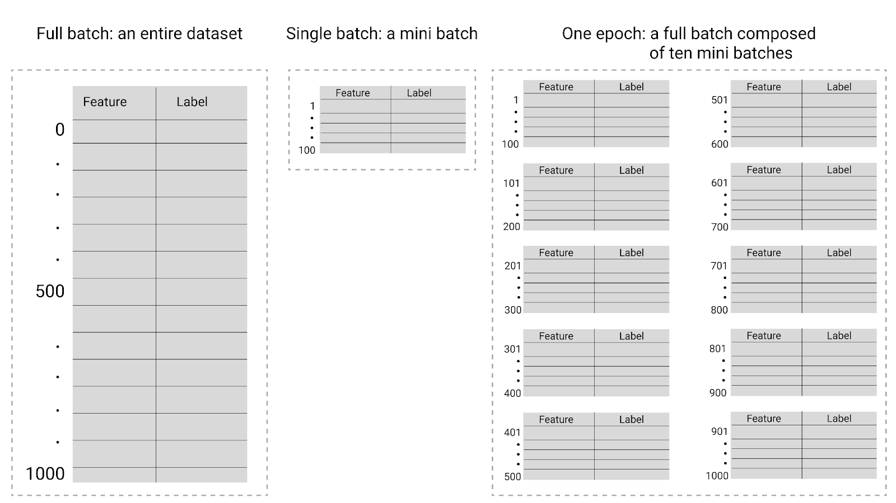

:PROPERTIES:
:ID:       1f304614-b5de-4749-9972-a488c9173cfb
:END:
#+title: 超参数
#+startup: overview
#+filetags: :线性回归:超参数:

超参数是控制训练不同方面的变量。以下是三种常见的超参数：
- 学习速率
- 批次大小
- 周期
相比之下，形参是模型本身的一部分，例如权重和偏差。换句话说，超参数是您控制的值；参数是模型在训练期间计算的值。
* 学习速率
学习速率是一个您设置的浮点数，用于影响模型收敛的速度。如果学习率过低，模型可能需要很长时间才能收敛。不过，如果学习速率过高，模型将永远无法收敛，而是在可最大限度减少损失的权重和偏差附近跳动。目标是选择一个既不太高也不太低的学习速率，以便模型快速收敛。

学习速率决定了在梯度下降过程的每一步中，对权重和偏差所做的更改幅度。模型将梯度乘以学习速率，以确定下一次迭代的模型参数（权重和偏差值）。在梯度下降的第三步中，沿负斜率方向移动的“少量”是指学习速率。

旧模型参数与新模型参数之间的差异与损失函数的斜率成正比。例如，如果斜率较大，模型会采取较大的步长。如果较小，则采取较小的步长。例如，如果梯度的大小为 2.5，学习率为 0.01，则模型会将形参更改 0.025。

理想的学习率有助于模型在合理的迭代次数内收敛。例如下图，损失曲线显示模型在前20次迭代中显著改进，然后开始收敛
#+ATTR_ORG: :width 600

相比之下，如果学习速率过小，则可能需要过多的迭代次数才能实现收敛，如下图，损失曲线显示模型在每次迭代后仅略有改进
#+ATTR_ORG: :width 600

过大的学习速率永远不会收敛，因为每次迭代都会导致损失在较大范围内波动或持续增加。
#+ATTR_ORG: :width 600

显示了用过大的学习速率训练的模型，其中损失曲线随着迭代次数的增加而剧烈波动，有时上升有时下降

#+ATTR_ORG: :width 600

显示了以过大的学习速率训练的模型，其中损失曲线在后来的迭代中急剧增加。
* 批次大小
批次大小是一种超参数，指的是模型在更新权重和偏差之前处理的示例数量。您可能会认为，模型应先计算数据集中每个样本的损失，然后再更新权重和偏差。不过，如果数据集包含数十万甚至数百万个示例，则使用完整批次并不实际。

以下两种常见技术可在不查看数据集中的每个示例的情况下，获得正确的平均梯度，然后更新权重和偏差：随机梯度下降和小批量随机梯度下降。
- 随机梯度下降法 (SGD)：随机梯度下降法在每次迭代中仅使用一个示例（批次大小为 1）。在迭代次数足够多的情况下，SGD 可以正常运行，但噪声非常大。“噪声”是指训练期间导致损失在迭代过程中增加而非减少的变化。“随机”一词表示每个批次中的一个示例是随机选择的。
  
  请注意，在下图中，当模型使用 SGD 更新权重和偏差时，损失会略有波动，这可能会导致损失图出现噪声：
  #+ATTR_ORG: :width 600
   
  请注意，使用随机梯度下降可能会在整个损失曲线中产生噪声，而不仅仅是在接近收敛时。
  
- 小批次随机梯度下降法（小批次 SGD）：小批次随机梯度下降法是全批次和 SGD 之间的折衷方案。对于N个数据点，批次大小可以是大于 1 且小于 N的任意数字。模型会随机选择每个批次中包含的示例，对它们的梯度求平均值，然后在每次迭代中更新一次权重和偏差。
  确定每个批次的样本数量取决于数据集和可用的计算资源。一般来说，小批量大小的行为类似于 SGD，而大批量大小的行为类似于全批量梯度下降。
  
  #+ATTR_ORG: :width 600
  
* 周期数
在训练期间，一个周期是指模型已处理训练集中的每个示例一次。例如，如果训练集包含 1,000 个示例，而小批次大小为 100 个示例，则模型需要 10 次迭代才能完成一个周期。

训练通常需要多个周期。也就是说，系统需要多次处理训练集中的每个示例。

周期数是一种超参数，您需要在模型开始训练之前设置该参数。在许多情况下，您需要通过实验来确定模型收敛所需的周期数。一般来说，训练周期数越多，模型效果越好，但训练时间也越长。

#+ATTR_ORG: :width 800

| 批次类型              | 权重和偏差更新何时发生                                                                                                                              |
|------------------------+-------------------------------------------------------------------------------------------------------------------------------------------------------|
| 完整批次              | 模型查看完数据集中的所有示例后。例如某个数据集包含1,000个样本，并且模型训练了20个周期，则模型会更细暖权重和偏差20次，每个周期更新一次 |
| 随机梯度下降法        | 模型查看数据集中的单个示例后。例如某个数据集包含1000个样本，并且训练了20个周期，则模型会更新权重和偏差20000次                                |
| 小批次随机梯度下降法 | 模型查看完每个批次中的示例后，如果某个数据集包含1000个样本，批次大小为100，并且模型训练了20个周期，则模型会更新权重和偏差200次              |
