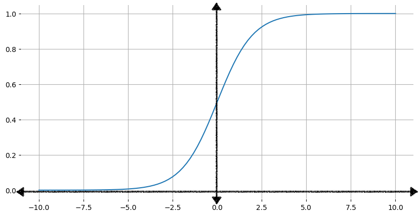
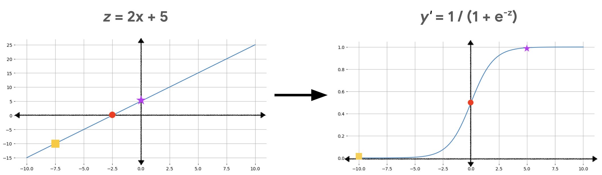

:PROPERTIES:
:ID:       ea6d61b6-a2c8-4c40-8ef4-4cd44c32f3ea
:END:
#+title: 逻辑回归
#+startup: overview latexpreview
#+filetags: :MachineLearning:Model:线性回归:

许多问题都需要将概率估计值作为输出。逻辑回归是一种用于计算概率的机制，可以通过以下两种方式之一使用返回的概率
- 按原样应用
  如果某个垃圾邮件也测模型将电子邮件作为输入，并输出值0.932，则表示该电子邮件是垃圾邮件的概率为93.2%
- 转换为二元类别
  例如True or False  Spam or Not Spam

* S型函数
逻辑回归模型要确保其输出表示的概率始终介于0到1之间的值。公式如下：
$$ f(x) = \frac{1}{1 + e^{-x}}  $$
其中：
- f(x)是函数的输出
- e是欧拉数：约为2.71828
- x是函数的输入

由上图可知，随着x的增加，s函数的输出会接近1，但永远不会达到1。同样，随着x的减小，s函数的输出会接近0，但永远不会达到0
* 使用S函数转换线性输出
以下等式表示的是逻辑回归模型的线性组成部分：
$$ z = b + w_1x_1 + w_2x_2 + ... + w_Nx_N$$
其中：
- z是线性方程的输出，也成为对数几率
- b是偏差
- w是该模型学习的权重
- x的值是特定样本的特征值
为了获得逻辑回归预测结果，接下来将z值传递给s函数，从而得到一个介于0和1之间的值（概率）：
$$y^{'} = \frac{1}{1 + e^{-z}}$$

#+ATTR_ORG: :width 1000

在图中，线性方程称为S型函数的输入，该函数将直线弯曲成S形。
#+begin_notes
注意： 线性方程可以输出非常大或非常小的z值，但是S函数的输出 $y^{'}$始终介于0和1之间（不含0和1）
#+end_notes

* 损失和正则化
** 对数损失函数
在线性回归模块化中，我们使用了$L_{2}$（平方损失函数）作为损失函数。对于输出值的变化率恒定的线性模型，平方损失函数效果更好。例如对于线性模型 $y^{'} = b + 3x_1$，每次将输入值$x_{1}$增加1时，输出值$y^{'}$就会增加3

不过，逻辑回归模型的变化率不是固定的。S型函数曲线呈S形，而不是线性。当对数几率（Z）值接近0时，Z的小幅增加会导致y的变化远大于Z为较大整数或负数时的变化，例如下表
| 输入 | 逻辑回归输出 | 所需的精确度位数 |
|------+---------------+-------------------|
|    5 |         0.993 |                 3 |
|    6 |         0.997 |                 3 |
|    7 |         0.999 |                 3 |
|    8 |        0.9997 |                 4 |
|    9 |        0.9999 |                 4 |
|   10 |       0.99998 |                 5 |

如果使用平方损失函数来计算S型函数的误差，那么随着输出越来越接近0和1，需要更多的内存来保持跟踪这些值的精度

所以逻辑回归的损失函数是对数损失函数。对数损失函数返回的是变化幅度的对数，而不仅仅是数据与预测之间的距离。计算方式如下：
$$loss = -\frac{1}{N}\sum^{N}_{i = 1}[y_i\log{y^{'}_i} + (1 - y_i)\log{1 - y^{'}_i}]$$

其中：
- N是数据集中的已标记示例数量
- i是数据集中示例的索引（例如（$x_{3},y_{3}$）是数据集中的第三个示例）
- $$y_{i}$$是第i个示例的标签，由于这是逻辑回归，所以$$y_{i}$$必须是0或1
- $$y^{'}_{i}$$是模型针对第i个示例的预测值（介于0和1之间），由$$x_{i}$$的特征集得出

* 逻辑回归的正则化
正则化是一种在训练期间惩罚模型复杂性的机制，在逻辑回归建模中非常重要。如果不进行正则化，在模型具有大量特征的情况下，逻辑回归的渐近性质会使损失不断趋近于 0。因此，大多数逻辑回归模型都采用以下两种策略之一来降低模型复杂性：
- L2正则化
- 早停法
  限制训练步数，以便在损失仍在减少时停止训练
